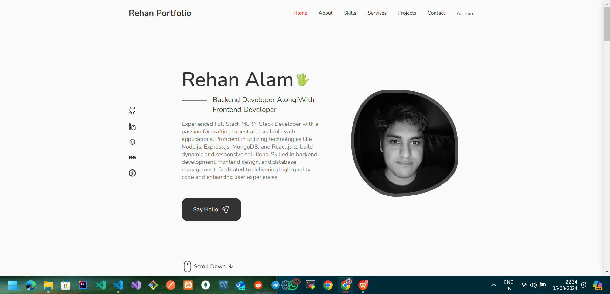
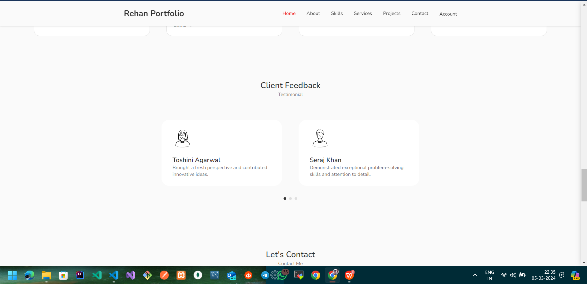
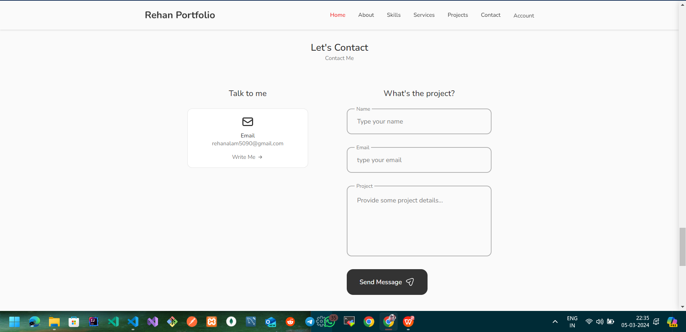

# Getting Started with Your Portfolio Website | Demo [Live](https://react-portfolio-steel-eight.vercel.app/)

Welcome to your portfolio website project! This project aims to showcase your skills, experience, and projects to potential clients, employers, or collaborators. Let's get started with setting up your portfolio website using Create React App.

This is a responsive portfolio site created with ReactJS and plain CSS that implements Swiper for sliding components and EmailJS for contact services.

## Available Scripts

In your project directory, you can run the following npm scripts:

### `npm start`

This script runs the development server for your portfolio website. It opens [http://localhost:3000](http://localhost:3000) in your browser, allowing you to view and test your website locally. The development server automatically reloads the page whenever you make changes to your code.

The slider component of the testimonial section is imported from [SwiperJS](

### `npm test`

Use this script to launch the test runner in interactive watch mode. You can write tests to ensure your website functions correctly and behaves as expected. Refer to the [testing documentation](https://reactjs.org/docs/testing.html) for more information on writing and running tests.

### `npm run build`

This script builds your portfolio website for production. It optimizes the build for better performance and bundles React in production mode. The production-ready files are stored in the `build` folder. You can deploy these files to a web hosting service to make your website live on the internet.

### `npm run eject`

**Note: This is a one-way operation. Once you `eject`, you can't go back!**

If you need more control over the build configuration and dependencies, you can eject from Create React App. Ejecting copies all configuration files and dependencies into your project, giving you full control over them. However, it's a one-way operation, and you won't be able to revert it.

## Learn More

You can learn more about Create React App and React by exploring the official documentation:

- [Create React App Documentation](https://create-react-app.dev/docs/getting-started/)
- [React Documentation](https://reactjs.org/docs/getting-started.html)

### Code Splitting, Bundle Size Analysis, and PWA

The documentation covers advanced topics such as code splitting, analyzing bundle size, and making a progressive web app. These features are useful for optimizing your portfolio website for performance and user experience.

### Advanced Configuration and Deployment

If you need to customize the build configuration further or explore advanced deployment options, refer to the advanced configuration and deployment sections in the documentation.

This is a responsive portfolio site created with ReactJS and plain CSS that implements Swiper for sliding components and EmailJS for contact services.

### Project Features:
- Responsive Layout
- Fixed Navigation
- Pop-up Modals
- Tab Panels
- Slider + Pagination
- Contact Form
- Scroll to Top

## React-Icons
`npm install react-icons --save`

The icons from this project can be found in the *Feather* or *Heroicon* sections of the [React-Icons](https://react-icons.github.io/react-icons/) library. 

## Slider Component
`npm i swiper`

The slider component of the testimonial section is imported from [SwiperJS](https://swiperjs.com/react) and also utlizes their pagination module.

## Email Component
`npm install @emailjs/browser --save`

The form modal of the contact section is setup using SDK and an email template from [EmailJS](https://www.emailjs.com/docs/examples/reactjs/).

